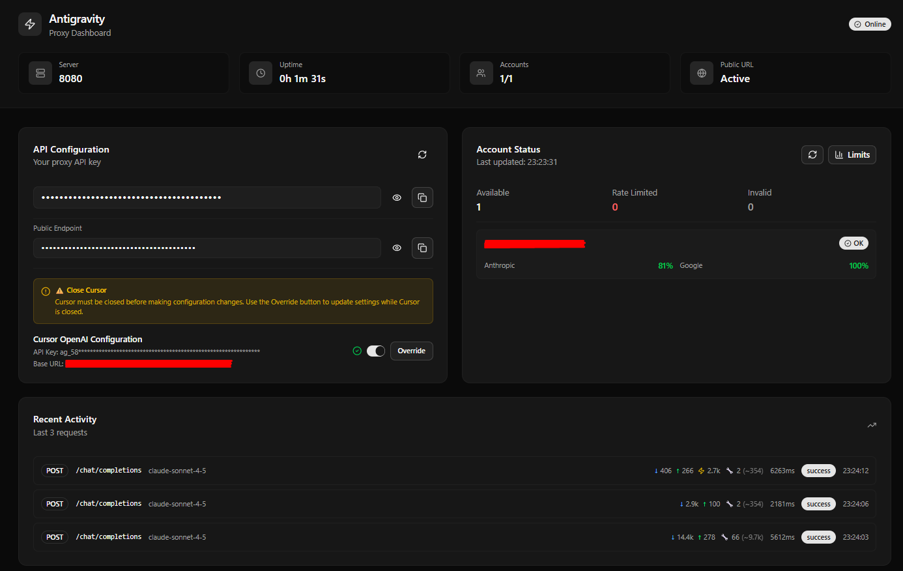

# Cursor AI Bridge

> **Note:** This is a fork/modified version of the original project. For the original project, please visit: [badri-s2001/antigravity-claude-proxy](https://github.com/badri-s2001/antigravity-claude-proxy)

> **Model Status:** Claude models are fully tested and working smoothly. Gemini models are available but have not been extensively tested yet.

**Tested and Working Models:**

| Model ID | Status | Description |
|----------|--------|-------------|
| `claude-sonnet-4-5-thinking` | ✅ Tested | Claude Sonnet 4.5 with extended thinking |
| `claude-opus-4-5-thinking` | ✅ Tested | Claude Opus 4.5 with extended thinking |
| `claude-sonnet-4-5` | ✅ Tested | Claude Sonnet 4.5 without thinking |
| `gemini-3-flash` | ⚠️ Not Yet Tested | Gemini 3 Flash with thinking |
| `gemini-3-pro-low` | ⚠️ Not Yet Tested | Gemini 3 Pro Low with thinking |
| `gemini-3-pro-high` | ⚠️ Not Yet Tested | Gemini 3 Pro High with thinking |

A local proxy server that exposes **Anthropic-compatible** and **OpenAI-compatible** APIs, allowing you to use Claude and Gemini models through **Cursor IDE** and other compatible tools. The proxy connects to Antigravity's Cloud Code API and provides seamless integration with Cursor IDE.

## Features

- 🔄 **Dual API Support**: Works with both Anthropic Messages API and OpenAI Chat Completions API formats
- 🎯 **Universal IDE Compatibility**: OpenAI-compatible format conversion enables use with Cursor IDE, OpenCode, and other OpenAI-compatible tools
- 🔐 **Multi-Account Support**: Automatic load balancing across multiple Google accounts with intelligent rate limit handling (inherited from original project)
- 🌐 **ngrok Integration**: Built-in ngrok tunnel support - required for Cursor IDE due to CSRF security restrictions
- 📊 **Web Dashboard**: Real-time monitoring with comprehensive account management interface
- 🚀 **Streaming Support**: Full support for streaming responses
- 💭 **Thinking Support**: Extended thinking capabilities for Claude models

## Web Dashboard

Access the web dashboard at `http://localhost:3030` (when running with `npm start` or `npm run start:full`) for comprehensive monitoring and management:



**Dashboard Features:**

- 📈 **Real-time Metrics**
  - Server status and uptime tracking
  - Active ngrok tunnel status
  - Account availability statistics
  - Live request monitoring

- 👥 **Account Management**
  - Visual account status indicators
  - Per-account quota tracking (Anthropic & Google models)
  - Rate limit monitoring with color-coded status
  - One-click account refresh and verification

- 📊 **Request Analytics**
  - Recent activity log with detailed metrics
  - Token usage tracking (input/output/cache)
  - Tool usage monitoring
  - Response time statistics
  - Cache hit indicators

- 🔑 **API Configuration**
  - Easy-copy API keys and ngrok URLs
  - Cursor IDE configuration helper
  - Secure credential display with toggle visibility

The dashboard auto-refreshes every 10 seconds for real-time updates, with account limits refreshing every 5 minutes.

## How It Works

```
╔══════════════════════════════════════════════════════════════════════════════╗
║                            PROXY ARCHITECTURE                                ║
╚══════════════════════════════════════════════════════════════════════════════╝

   ┌─────────────────────────────────────────────────────────────────────┐
   │                         🌐 ngrok HTTPS Tunnel                       │
   │                    https://your-id.ngrok.io                         │
   └────────────────────────────────┬────────────────────────────────────┘
                                    │
                                    ▼
   ┌─────────────────────────────────────────────────────────────────────┐
   │  💻 CURSOR IDE / OpenCode / Any OpenAI-Compatible Client            │
   │  ─────────────────────────────────────────────────────────────────  │
   │  Request Format:                                                    │
   │  • OpenAI Chat Completions API   (/chat/completions)                │
   │  • Anthropic Messages API        (/v1/messages)                     │
   └────────────────────────────────┬────────────────────────────────────┘
                                    │
                                    ▼
   ┌─────────────────────────────────────────────────────────────────────┐
   │  🔄 ANTIGRAVITY CLAUDE PROXY SERVER (localhost:8080)                │
   │  ─────────────────────────────────────────────────────────────────  │
   │  Features:                                                          │
   │  ✓ API Format Conversion    (OpenAI ⟷ Anthropic ⟷ Google)         │
   │  ✓ Multi-Account Manager    (Load Balancing + Rate Limit Handling) │
   │  ✓ Token Usage Tracking     (Input/Output/Cache metrics)           │
   │  ✓ Streaming Support        (SSE for real-time responses)          │
   │  ✓ Web Dashboard            (Real-time monitoring at :3030)        │
   └────────────────────────────────┬────────────────────────────────────┘
                                    │
                          ┌─────────┴─────────┐
                          │  Account Router   │
                          │  (Sticky Session) │
                          └─────────┬─────────┘
                                    │
              ┌─────────────────────┼─────────────────────┐
              │                     │                     │
              ▼                     ▼                     ▼
   ┌──────────────────┐  ┌──────────────────┐   ┌──────────────────┐
   │ 📧 Account #1    │  │ 📧 Account #2    │  │ 📧 Account #3    │
   │ Status: ✅ OK    │  │ Status: ⚠️ Limit │  │ Status: ✅ OK    │
   │ Quota: 85%       │  │ Quota: 5%        │   │ Quota: 62%       │
   └────────┬─────────┘  └──────────────────┘   └────────┬─────────┘
            │                                            │
            └────────────────────────────────────────────┘


╔══════════════════════════════════════════════════════════════════════════════╗
║                              REQUEST FLOW                                    ║
╚══════════════════════════════════════════════════════════════════════════════╝

  1️⃣  IDE sends request → OpenAI/Anthropic format
  
  2️⃣  Proxy receives → Validates API key → Selects available account
  
  3️⃣  Format conversion → Google Generative AI + Cloud Code wrapping
  
  4️⃣  OAuth token injection → Request to Antigravity API
  
  5️⃣  Response received → Format conversion back to OpenAI/Anthropic
  
  6️⃣  Streaming/Complete response → IDE receives data
  
  7️⃣  Metrics logged → Dashboard updated with token usage & timing
```

**🎯 Key Advantages:**

- **Universal Compatibility**: Converts Claude/Gemini responses to OpenAI-compatible format, making it usable with **any IDE or tool** that supports OpenAI's API
- **Intelligent Load Balancing**: Automatically distributes requests across multiple Google accounts with smart rate limit detection
- **Transparent Metrics**: Full visibility into token usage (input/output/cache), response times, and account health
- **Zero Downtime**: Rate-limited accounts are automatically skipped while maintaining cache efficiency through sticky sessions

## Prerequisites

- **Node.js** 18 or later
- **Antigravity** installed and running (for single-account mode) OR Google account(s) for multi-account mode
- **ngrok** (required for Cursor IDE integration, see [Why ngrok?](#why-ngrok) section below)
- **Cursor IDE** or any OpenAI-compatible IDE/tool (optional)

## Installation

### Clone the Repository

```bash
git clone https://github.com/zog06/cursor-ai-bridge.git
cd cursor-ai-bridge
```

### Install Dependencies

```bash
# Install backend dependencies
npm install

# Install frontend dependencies (for dashboard)
cd frontend
npm install
cd ..
```

## Quick Start

### 1. Add Google Account(s)

You have two options:

**Option A: Use Antigravity (Single Account)**

If you have Antigravity installed and running with a chat panel open, the proxy will automatically extract your token. No additional setup needed.

**Option B: Add Google Accounts via OAuth (Recommended for Multi-Account)**

Add one or more Google accounts for load balancing:

```bash
npm run accounts add
```

This opens your browser for Google OAuth. Sign in and authorize access. Repeat for multiple accounts.

**Manage accounts:**

```bash
npm run accounts              # Interactive account management
npm run accounts list         # List all accounts
npm run accounts verify       # Verify accounts are working
npm run accounts remove       # Remove accounts interactively
```

### 2. Setup ngrok (Required for Cursor IDE)

**Why ngrok?** Cursor IDE and many other modern IDEs implement CSRF (Cross-Site Request Forgery) protection that blocks requests from `localhost` or `http://` endpoints. ngrok creates a secure HTTPS tunnel that bypasses these restrictions, allowing the IDE to communicate with the proxy server.

**Setup ngrok:**

1. Sign up for a free account at [ngrok.com](https://ngrok.com) (free plan is sufficient for normal usage)
2. Install ngrok: [ngrok installation guide](https://ngrok.com/download)
3. Add your authtoken:

```bash
ngrok config add-authtoken YOUR_NGROK_TOKEN
```

**Note:** The free ngrok plan provides more than enough bandwidth and connections for typical development use. You don't need a paid plan unless you're doing high-volume testing or production deployments.

### 3. Start the Proxy Server

**Default (Full stack - backend + frontend + ngrok):**

```bash
npm start
```

This is the default command that starts everything you need: backend server, frontend dashboard, and ngrok tunnel.

**Other options:**

**Backend only (without ngrok):**

```bash
npm run start:backend
```

**Backend with ngrok tunnel (no frontend):**

```bash
npm run start:ngrok
```

**Backend + frontend (without ngrok):**

```bash
npm run start:all
```

**Full stack (same as `npm start`):**

```bash
npm run start:full
```

**Windows PowerShell (full stack):**

```powershell
.\start-full.ps1
```

**Windows PowerShell (with ngrok):**

```powershell
.\start-with-ngrok.ps1
```

The server runs on `http://localhost:8080` by default.
The frontend dashboard runs on `http://localhost:3030` by default.

**Important:** The server will generate a random API key on first startup if `ANTIGRAVITY_PROXY_API_KEY` is not set. **Save this key** - you'll need it to configure Cursor IDE.

**Custom API Key:**

```bash
ANTIGRAVITY_PROXY_API_KEY=your-secret-key-here npm start
```

**Custom Port:**

```bash
PORT=3000 npm start
```

**Note:** `npm start` starts the full stack (backend + frontend + ngrok) by default. If you only need the backend server, use `npm run start:backend` instead.

### 4. Configure Your IDE

The proxy works with any IDE or tool that supports OpenAI's API format. The server automatically converts Claude/Gemini responses to OpenAI-compatible format, making it compatible with:

- **Cursor IDE** - Automatic configuration available
- **OpenCode** - OpenAI-compatible format
- **Continue.dev** - OpenAI-compatible format
- **Any OpenAI-compatible tool** - Standard OpenAI Chat Completions API

**Cursor IDE Configuration:**

The proxy can automatically configure Cursor IDE settings. When you start the server, it will detect Cursor and offer to configure it automatically.


**Other IDEs/Tools:**

For any OpenAI-compatible tool, use the ngrok URL (when using ngrok) or localhost URL:

```
Base URL: https://YOUR_NGROK_URL.ngrok.io/chat/completions
API Key: YOUR_API_KEY_FROM_SERVER_STARTUP
```

Or for local development (if your IDE doesn't block localhost):

```
Base URL: http://localhost:8080/chat/completions
API Key: YOUR_API_KEY_FROM_SERVER_STARTUP
```

### 5. Verify It's Working

```bash
# Health check (no authentication required)
curl http://localhost:8080/health

# Check account status and quota limits (requires API key)
curl -H "Authorization: Bearer YOUR_API_KEY" "http://localhost:8080/account-limits?format=table"
# Or using x-api-key header:
curl -H "x-api-key: YOUR_API_KEY" "http://localhost:8080/account-limits?format=table"
```

## Available Models

### Claude Models

| Model ID | Description |
|----------|-------------|
| `claude-sonnet-4-5-thinking` | Claude Sonnet 4.5 with extended thinking |
| `claude-opus-4-5-thinking` | Claude Opus 4.5 with extended thinking |
| `claude-sonnet-4-5` | Claude Sonnet 4.5 without thinking |

### Gemini Models

| Model ID | Description |
|----------|-------------|
| `gemini-3-flash` | Gemini 3 Flash with thinking |
| `gemini-3-pro-low` | Gemini 3 Pro Low with thinking |
| `gemini-3-pro-high` | Gemini 3 Pro High with thinking |

Gemini models include full thinking support with `thoughtSignature` handling for multi-turn conversations.

## API Endpoints

| Endpoint | Method | Description |
|----------|--------|-------------|
| `/health` | GET | Health check |
| `/account-limits` | GET | Account status and quota limits (add `?format=table` for ASCII table) |
| `/v1/messages` | POST | Anthropic Messages API |
| `/chat/completions` | POST | OpenAI Chat Completions API |
| `/v1/models` | GET | List available models |
| `/refresh-token` | POST | Force token refresh |

## Multi-Account Load Balancing

This feature is inherited from the original project and provides robust account management:

When you add multiple accounts, the proxy automatically:

- **Sticky account selection**: Stays on the same account to maximize prompt cache hits
- **Smart rate limit handling**: Automatically waits for short rate limits (≤2 min), switches accounts for longer ones
- **Automatic cooldown**: Rate-limited accounts become available after reset time expires
- **Invalid account detection**: Accounts needing re-authentication are marked and skipped
- **Prompt caching support**: Stable session IDs enable cache hits across conversation turns

This intelligent load balancing ensures uninterrupted service even when individual accounts hit rate limits, making it ideal for heavy development workloads.

Check account status anytime:

```bash
curl "http://localhost:8080/account-limits?format=table"
```

Or visit the web dashboard at `http://localhost:3030`

## Development

**Development mode with auto-reload:**

```bash
npm run dev              # Full stack (backend + frontend + ngrok) - default
npm run dev:ngrok        # Backend with ngrok only
npm run dev:all          # Backend + frontend (without ngrok)
npm run dev:full         # Full stack (backend + frontend + ngrok) - same as dev
```

## Testing

Run the test suite (requires server running):

```bash
# Start server in one terminal (backend only for testing)
npm run start:backend

# Run tests in another terminal
npm test
```

**Note:** For testing, you typically only need the backend server. Use `npm run start:backend` instead of `npm start` to avoid starting frontend and ngrok unnecessarily.

Individual tests:

```bash
npm run test:signatures    # Thinking signatures
npm run test:multiturn     # Multi-turn with tools
npm run test:streaming     # Streaming SSE events
npm run test:interleaved   # Interleaved thinking
npm run test:images        # Image processing
npm run test:caching       # Prompt caching
```

## Troubleshooting

### "Could not extract token from Antigravity"

If using single-account mode with Antigravity:
1. Make sure Antigravity app is installed and running
2. Ensure you're logged in to Antigravity
3. Open a chat panel in Antigravity

Or add accounts via OAuth instead: `npm run accounts add`

### 401 Authentication Errors

The token might have expired. Try:

```bash
curl -X POST http://localhost:8080/refresh-token
```

Or re-authenticate the account:

```bash
npm run accounts
# Choose "Re-authenticate" for the problematic account
```

### Rate Limiting (429)

With multiple accounts, the proxy automatically switches to the next available account. With a single account, you'll need to wait for the rate limit to reset.

### Account Shows as "Invalid"

Re-authenticate the account:

```bash
npm run accounts
# Choose "Re-authenticate" for the invalid account
```

### Cursor IDE Not Connecting

1. **Make sure ngrok is running**: Cursor IDE requires ngrok tunnel due to CSRF protection. The default `npm start` command includes ngrok, or use `npm run start:ngrok` for backend + ngrok only
2. Verify the server is running: `curl http://localhost:8080/health`
3. Check the API key matches in Cursor settings
4. Ensure the base URL uses the ngrok HTTPS URL (not localhost)
5. Restart Cursor IDE after changing settings

**If using localhost instead of ngrok:**
Cursor IDE blocks localhost requests for security reasons. You must use ngrok for Cursor IDE integration. The free ngrok plan is sufficient for development use.

## Safety, Usage, and Risk Notices

### Intended Use

- Personal / internal development only
- Respect internal quotas and data handling policies
- Not for production services or bypassing intended limits

### Not Suitable For

- Production application traffic
- High-volume automated extraction
- Any use that violates Acceptable Use Policies

### Warning (Assumption of Risk)

By using this software, you acknowledge and accept the following:

- **Terms of Service risk**: This approach may violate the Terms of Service of AI model providers (Anthropic, Google, etc.). You are solely responsible for ensuring compliance with all applicable terms and policies.

- **Account risk**: Providers may detect this usage pattern and take punitive action, including suspension, permanent ban, or loss of access to paid subscriptions.

- **No guarantees**: Providers may change APIs, authentication, or policies at any time, which can break this method without notice.

- **Assumption of risk**: You assume all legal, financial, and technical risks. The authors and contributors of this project bear no responsibility for any consequences arising from your use.

**Use at your own risk. Proceed only if you understand and accept these risks.**

## Legal

- **Not affiliated with Google or Anthropic.** This is an independent open-source project and is not endorsed by, sponsored by, or affiliated with Google LLC or Anthropic PBC.

- "Antigravity", "Gemini", "Google Cloud", and "Google" are trademarks of Google LLC.

- "Claude" and "Anthropic" are trademarks of Anthropic PBC.

- Software is provided "as is", without warranty. You are responsible for complying with all applicable Terms of Service and Acceptable Use Policies.

## Why ngrok?

Modern IDEs like Cursor implement CSRF (Cross-Site Request Forgery) protection mechanisms that block requests from:
- `localhost` endpoints
- `http://` (non-HTTPS) endpoints
- Local network addresses

ngrok solves this by creating a secure HTTPS tunnel (`https://your-tunnel.ngrok.io`) that:
- Provides a valid HTTPS certificate
- Routes traffic to your local proxy server
- Bypasses IDE security restrictions
- Works seamlessly with Cursor IDE and other security-conscious tools

**Free Plan Sufficiency:** ngrok's free plan provides:
- 1 ngrok agent
- Unlimited tunnels
- Sufficient bandwidth for normal development usage
- No credit card required

The free plan is more than adequate for individual developers. Paid plans are only needed for high-volume production deployments or team usage.

## Credits

**Current Maintainer:** [zog06](https://github.com/zog06)

This project is a fork/modified version based on:

- **[badri-s2001/antigravity-claude-proxy](https://github.com/badri-s2001/antigravity-claude-proxy)** - Original project by Badri Narayanan S

**Key Features Inherited from Original Project:**
- Multi-account support with intelligent load balancing
- Automatic rate limit detection and account switching
- OAuth-based Google account management
- Robust error handling and account recovery

The original project was based on insights and code from:

- [opencode-antigravity-auth](https://github.com/NoeFabris/opencode-antigravity-auth) - Antigravity OAuth plugin for OpenCode
- [claude-code-proxy](https://github.com/1rgs/claude-code-proxy) - Anthropic API proxy using LiteLLM

## License

MIT License

Copyright (c) 2026 zog06

This project is a fork/modified version of [badri-s2001/antigravity-claude-proxy](https://github.com/badri-s2001/antigravity-claude-proxy)

**Original Project:** Copyright (c) 2024 Badri Narayanan S

Permission is hereby granted, free of charge, to any person obtaining a copy of this software and associated documentation files (the "Software"), to deal in the Software without restriction, including without limitation the rights to use, copy, modify, merge, publish, distribute, sublicense, and/or sell copies of the Software, and to permit persons to whom the Software is furnished to do so, subject to the following conditions:

The above copyright notice and this permission notice shall be included in all copies or substantial portions of the Software.

THE SOFTWARE IS PROVIDED "AS IS", WITHOUT WARRANTY OF ANY KIND, EXPRESS OR IMPLIED, INCLUDING BUT NOT LIMITED TO THE WARRANTIES OF MERCHANTABILITY, FITNESS FOR A PARTICULAR PURPOSE AND NONINFRINGEMENT. IN NO EVENT SHALL THE AUTHORS OR COPYRIGHT HOLDERS BE LIABLE FOR ANY CLAIM, DAMAGES OR OTHER LIABILITY, WHETHER IN AN ACTION OF CONTRACT, TORT OR OTHERWISE, ARISING FROM, OUT OF OR IN CONNECTION WITH THE SOFTWARE OR THE USE OR OTHER DEALINGS IN THE SOFTWARE.

See [LICENSE](LICENSE) file for full text.
